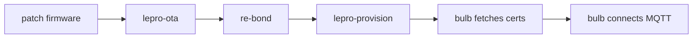

# MQTT setup (optional)

Point a bonded light at **your** broker and CDN instead of Lepro cloud.

Install the Python tools once (`cd lepro && uv sync`). MQTT commands below use `uv run`
from `lepro/`; paths to repo-root files use `../`.

## Overview



## 1. Configuration

```bash
cp lepro-lab.toml.example lepro-lab.toml
```

Edit `[lab]` hostnames, `[wifi]` credentials, and `[device].id` (numeric device id for MQTT topics).

DNS (or `/etc/hosts`) must resolve `cdn_host` and `mqtt_host` to the machine running the lab stack. The bulb validates TLS by hostname.

## 2. Lab stack

```bash
./deploy/docker/up.sh
```

Starts Mosquitto (1883 plain + 8883 TLS) and nginx CDN (443). See [../deploy/docker/README.md](../deploy/docker/README.md).

Advanced: k8s deploy in [../deploy/lepro-debug/](../deploy/lepro-debug/).

## 3. Firmware

```bash
cd lepro
uv run lepro-firmware fetch
uv run lepro-firmware patch
```

`patch` pins your CDN cert and removes two stock gates so certs are re-fetched on every
provision. See [firmware.md](firmware.md).

## 4. Flash and provision

```bash
uv run lepro-ota --mac AA:BB:CC:DD:EE:FF \
  --firmware ../firmware/3_le_light_zb1_pid_55_v2.3.18.patched.bin
uv run lepro-bond --mac AA:BB:CC:DD:EE:FF --force-bond
uv run lepro-provision --mac AA:BB:CC:DD:EE:FF --config ../lepro-lab.toml
```

## 5. Verify native MQTT

```bash
mosquitto_pub -h mqtt.example.home -p 8883 \
  --cafile deploy/docker/certs/ca.pem --insecure \
  -t "le/3619294555/prp/set" -m '{"d":{"d1":1}}'
```

Use `--insecure` if connecting by IP while the cert SAN is a hostname.

## 6. Standardized topics (optional)

Run the Go bridge in [../bridge/](../bridge/) per [bridge-contract.md](bridge-contract.md), then attach any MQTT consumer (Home Assistant, Node-RED, [homebridge example](examples/homebridge-easy-mqtt.md)).

## mTLS note

The bulb downloads your mock client cert bundle but signs TLS with a **factory-provisioned** private key. True mTLS against Mosquitto will fail. The lab broker uses `require_certificate false` and anonymous connections after server-auth TLS. Details in [protocol.md](protocol.md).

## Cert rotation

If you regenerate PKI (`gen-certs.sh`), restart Mosquitto and CDN, then re-provision
so the bulb re-fetches certs. Patched firmware (`lepro-firmware patch`, default)
re-downloads root/client certs on every provision; stock firmware only re-fetches in
onboarding mode — see [firmware.md](firmware.md).
